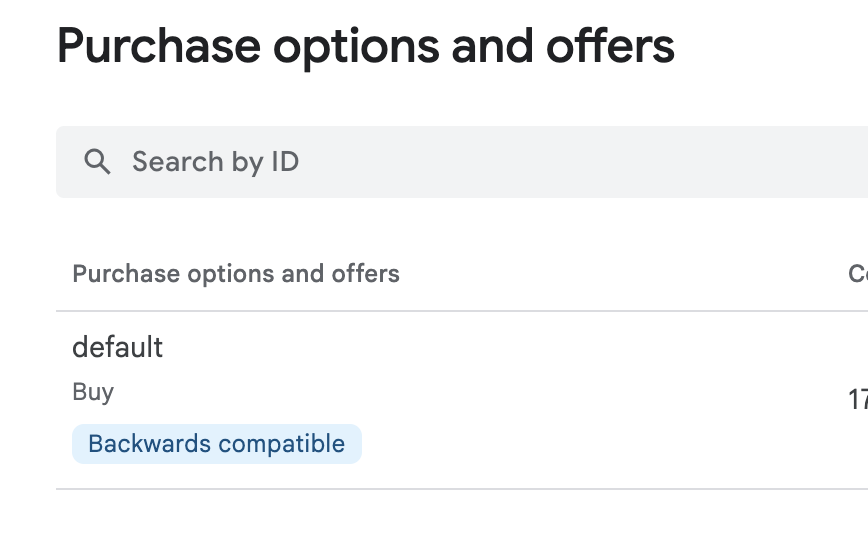

***Looking for [IOS Apple App Store](https://github.com/ANU-CHEEKI-BREEKI/app-store-connect-prices-localizer) analog?***

---

Have you ever created ***IAPs*** (In-App Purchases) for your app on Google Play?

Have you thought about ***setting regional prices*** to make purchases more accessible in countries with lower purchasing power?

Doing this ***manually***, even for a single IAP, ***is a nightmare...***

In this repository, there is a program that will help you ***automatically*** update all prices according to your *regional pricing template*.

---

### ATTENTION

``THE PROJECT WAS UPDATED TO USE NEW GOOGLE APIS FOR Onetimeproducts``
  
``but, since i (as Unity game-dev) dont use IAP purchase options, and use only the Default purchase option, this project designed to work only with single "LegacyCompatible"/"Backward compatible" purchase option``

---

### How to use

One command:

    dotnet run localize

And all prices will be localized!

**Or you can run the program without parameters. It will display a more detailed help in the console.**

**You also need to set up `../config.json` file**

    {
        "PackageName": "com.MyApp.Package",
        "CredentialsFilePath": "./oauth_client_credentials.json",
        "DefaultPricesFilePath": "./default-prices.json",
        "DefaultCurrency": "USD"
    }

`CredentialsFilePath` and `DefaultPricesFilePath` are relative to `config.json`

**About Credentials [HERE](#The-pain-in-the-ass)**

There are example of default-prices.json 
Prices are in `DefaultCurrency` specified in `config.json` - in this example its (USD) 

    {
        "crystals_1": 10,
        "crystals_6": 50,
    }

---

### How it works

In the file `localized-prices-template.json`, there are multipliers for each country's prices.

    {
        "AE": 0.85,
        "AT": 1.0,
        "AU": 1.0,
        "BD": 0.3,
        "BE": 1.0,
        "BG": 0.6,
        "BH": 0.85
        //...
    }

- The program retrieves a list of all IAPs using the [Google Play Developer APIs](https://developers.google.com/android-publisher), resets their prices to the default price (just like you can do manually in the Google Play Console by clicking on "Update Exchange Rate").
- Then, the program multiplies the local prices by the corresponding multipliers from the `localized-prices-template.json` file.
- After that, the prices are rounded.
- Then, 0.01 is subtracted from the price to make round prices like `10$` become `9.99$`.
- Finally, the program uses the [Google Play Developer APIs](https://developers.google.com/android-publisher) to update the IAPs in your project on the Google Play Console.

---

**Waring**

Because of rounding - small prices can stay unchanged (0.99 usd became 0.99 usd).
To fix this is required to ask google apis to convert localized price (0.99 * 72% for example) to target currency. This will make sure price a valid. But thats required more work and will take mre time for program to execute. I dont care about this to much, so i did not implement this yet.

---

Google Console does not allow decimal prices for some countries, so the `round-prices-for.json` file contains exceptions. For these countries, the prices will be rounded (no more `9.99`, only `10`).

Currently, the list of exceptions is relatively small:

    ["CI", "CL", "CM", "IL", "JP", "KR", "PY", "SN", "VN"]

---

### The pain in the ass

To access your project through [Google Play Developer APIs](https://developers.google.com/android-publisher), ***you need to create a desktop OAuth client*** in your [Google Cloud Console](https://console.cloud.google.com/apis/credentials) for your project and ensure that the project in [Google Cloud Console](https://console.cloud.google.com/apis/credentials) is ***either live*** or ***you are a tester***.

Then download the **`Client secrets`** of the created OAuth desktop client. This file will be your **`oauth_client_credentials.json`**.

---

### A couple more commands

`list [-l]`
    To simply list all IAPs in your project. `-l` To print all local prices, instead of only default prices.

`restore [-v] [-l]`
    To reset all local prices to the default prices. `-v` To see IAPs lists during restoring, `-l` to also see local prices

---

### Examples

1. You cloned the repository and built the program.
1. You open the command line in the project folder.
1. You downloaded and placed the `client_credentials.json` file with the `client secrets` in the folder next to the project folder.
1. you created and placed the `config.json` file in the folder next to the project folder.
1. you created and placed the `default-prices-in-local-currency.json` file in the folder next to the project folder.
1. The app for which you want to localize prices has the package name `com.MyApp.Package`.

your config.json

    {
        "PackageName": "com.MyApp.Package",
        "CredentialsFilePath": "./oauth_client_credentials.json",
        "DefaultPricesFilePath": "./default-prices.json",
        "DefaultCurrency": "USD"
    }

your default-prices.json

    {
        "crystals_1": 10,
        "crystals_6": 50,
    }

You opened Project in visual studio code and opened terminal.
Then, your commands will likely look like this:

To see the list of all IAPs:

    dotnet run -- list -l

To reset local prices to the default prices:

    dotnet run -- restore

To localize the prices:

    dotnet run -- localize

_first extra `--` its delimiter for `dotnet run` so you can pass any parameters and they all will be passe to our program instead of `dotnet run` command._

