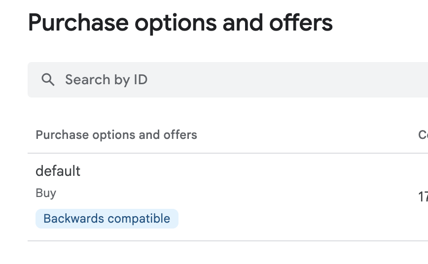

***Looking for [IOS Apple App Store](https://github.com/ANU-CHEEKI-BREEKI/app-store-connect-prices-localizer) analog?***

---

Have you ever created ***IAPs*** (In-App Purchases) for your app on Google Play?

Have you thought about ***setting regional prices*** to make purchases more accessible in countries with lower purchasing power?

Doing this ***manually***, even for a single IAP, ***is a nightmare...***

In this repository, there is a program that will help you ***automatically*** update all prices according to your *regional pricing template*.

---

### ATTENTION

``THE PROJECT WAS UPDATED TO USE NEW GOOGLE APIS FOR Onetimeproducts``
  
``but, since i (as Unity game-dev) dont use IAP purchase options, and use only the Default purchase option, this project designed to work only with single "LegacyCompatible"/"Backward compatible" purchase option``

---

### How to use

One command:

    dotnet run localize

And all prices will be localized!

**Or you can run the program without parameters. It will display a more detailed help in the console.**

**You also need to set up `../config.json` file**

    {
        "PackageName": "com.MyApp.Package",
        "CredentialsFilePath": "./oauth_client_credentials.json",
        "ProductDefinitionsFilePath": "./product-definitions.csv",
        "DefaultCurrency": "USD"
    }

`CredentialsFilePath` and `ProductDefinitionsFilePath` are relative to `config.json`

**About Credentials [HERE](#The-pain-in-the-ass)**

Base prices come from the `default_price` column of `product-definitions.csv` - the same file
`export-iaps` writes and `create-iaps` reads, so every command shares one source of prices.
No csv yet? Run `export-iaps` once and it is created from what the store has now.
Prices are in `DefaultCurrency` specified in `config.json` - in this example its (USD)

    product_id,default_price,title,description
    crystals_1,10,"Handful of crystals","A small pile of crystals."
    crystals_6,50,"Bag of crystals","A big bag of crystals."

---

### How it works

In the file `localized-prices-template.json`, there are multipliers for each country's prices.

    {
        "AE": 0.85,
        "AT": 1.0,
        "AU": 1.0,
        "BD": 0.3,
        "BE": 1.0,
        "BG": 0.6,
        "BH": 0.85
        //...
    }

- The program retrieves a list of all IAPs using the [Google Play Developer APIs](https://developers.google.com/android-publisher), and takes each product's base price from the `default_price` column of `product-definitions.csv` (run `export-iaps` once to create it). This is the price you can also set manually in the Google Play Console by clicking on "Update Exchange Rate".
- Then, the program multiplies the local prices by the corresponding multipliers from the `localized-prices-template.json` file.
- After that, the prices are rounded.
- Then, 0.01 is subtracted from the price to make round prices like `10$` become `9.99$`.
- Finally, the program uses the [Google Play Developer APIs](https://developers.google.com/android-publisher) to update the IAPs in your project on the Google Play Console.

`localize` does not need a `restore` first, and never did: the base price is read from the csv,
not from the store, so the localized prices are the only thing it writes. `restore` is the command
for the other case - putting the plain converted default prices back, without the template.
Do not run the two at the same time, they write the same products.

The exchange rates are asked once per distinct price instead of once per product, the products are
sent to Google several at a time, and only the products that actually got new prices are sent at
all. `--parallel <n>` (1 to 16, default 8) decides how many go at once - Google needs about two
minutes per product, so that number is what decides how long the run takes.

---

**Waring**

Because of rounding - small prices can stay unchanged (0.99 usd became 0.99 usd).
To fix this is required to ask google apis to convert localized price (0.99 * 72% for example) to target currency. This will make sure price a valid. But thats required more work and will take mre time for program to execute. I dont care about this to much, so i did not implement this yet.

---

Google Console does not allow decimal prices for some countries, so the `round-prices-for.json` file contains exceptions. For these countries, the prices will be rounded (no more `9.99`, only `10`).

Currently, the list of exceptions is relatively small:

    ["CI", "CL", "CM", "IL", "JP", "KR", "PY", "SN", "VN"]

---

### The pain in the ass

To access your project through [Google Play Developer APIs](https://developers.google.com/android-publisher), ***you need to create a desktop OAuth client*** in your [Google Cloud Console](https://console.cloud.google.com/apis/credentials) for your project and ensure that the project in [Google Cloud Console](https://console.cloud.google.com/apis/credentials) is ***either live*** or ***you are a tester***.

Then download the **`Client secrets`** of the created OAuth desktop client. This file will be your **`oauth_client_credentials.json`**.

---

### Profiles: never type `--config` again

The app configs live outside of this (public) repo, so every command used to need
`--config <path>`. Register the path once under a name instead:

    dotnet run -- config add titan-souls ../apps-configs/titan-souls
    dotnet run -- config add island-raid ../apps-configs/island-raid

The first profile you add becomes the current one, so from now on plain `dotnet run -- list`
just works. To switch:

    dotnet run -- config use island-raid
    dotnet run -- config list

    dotnet run -- list --profile titan-souls     # one-off, current profile stays

Profiles are stored in `~/.config/gps-iap/profiles.json`, the same way `gcloud` or `gh` keep
theirs. The config is picked in this order: `--config <path>`, `--profile <name>`, the current
profile, and finally `../config.json`.

---

### A couple more commands

`list [-l]`
    To simply list all IAPs in your project. `-l` To print all local prices, instead of only default prices.

`restore [-v] [-l]`
    To reset all local prices to the default prices from the `default_price` column of `product-definitions.csv`, without the percentage template. `-v` To see IAPs lists during restoring, `-l` to also see local prices

`--parallel <n>`
    Works with `restore` and `localize`: how many products go to Google at once, 1 to 16, default 8.

`--iap <id[,id...]>`
    Works with every command that touches products: run it only for these product ids, comma separated.
    Handy right after `create-iaps`, so `localize` does not re-send the whole catalog:

        dotnet run -- localize --iap pack_new_one,pack_new_two

---

### Creating new IAPs from a csv

The Play Console has no bulk way to add products, and clicking twenty of them in by hand is exactly
as fun as it sounds. So there is a small round trip instead: export what you already have, add rows
to it in a spreadsheet, send it back.

    dotnet run -- export-iaps

writes every One-time product into the csv at `ProductDefinitionsFilePath` from `config.json`
(`./product-definitions.csv` next to it by default):

    product_id,default_price,title,description
    crystals_1,0.99,Tiny of Gems,Tiny of Gems
    crystals_6,99.99,Vault of Gems,Vault of Gems

The price column is the price in your `DefaultRegion` only. All the other regions are left out on
purpose, they are what `localize` computes from the percentage template.

The title and the description are the store listing in `DefaultLanguageCode` (`en-US` by default).
The other languages are not exported, and a created product gets that one listing only, the rest are
added in the Play Console.

Add a row per new product, then:

    dotnet run -- create-iaps -n     # dry run, shows what would be created
    dotnet run -- create-iaps        # for real, the products are activated right away
    dotnet run -- localize --iap new_one,new_two   # apply the percentage template to them

A freshly created product is a draft nobody can buy, so `create-iaps` activates it on its own
(`--no-activate` to skip that). For products created elsewhere, or after a failed activation:

    dotnet run -- activate           # everything that is not active yet
    dotnet run -- activate --iap new_one,new_two

Products that already exist are skipped and **never** modified, so running `create-iaps` twice is
safe and the file can stay as a full snapshot of your catalog. Existing prices are only ever touched
by `restore` and `localize`.

All new products go to Google in **one batch request**, the way Google recommends for catalog
creation (`allowMissing` + `LATENCY_TOLERANT`). Prices for every region come from Google's own
exchange rates, and the region list is copied from a product you already have, so a new product
lands in exactly the same countries as the rest of your catalog. The tax category is not set, the
products get the Play Console default.

One row per product. Only the backward compatible purchase option is exported, and a created product
gets exactly one. The csv separator is detected automatically, so re-exporting the file from Numbers
or Excel as `;`-separated works too.

---

### Android vitals export

The Play Console shows crashes, ANRs, slow starts and the rest of Android vitals spread over dozens of screens,
with the actually interesting slices (this device model, that API level, that one release) hidden behind filters.

    dotnet run vitals

exports all of it into **one markdown file** you can drop into ChatGPT/Claude and just ask *"what is wrong with my app?"*.

The report contains:

- daily (or hourly) timelines for crash rate, ANR rate and error report counts - including the `userPerceived*`
  variants Google uses for the "bad behaviour" thresholds (2% crashes / 0.47% ANRs)
- breakdowns by `versionCode`, `apiLevel`, `deviceModel` and `countryCode`, ranked by real impact
  (`rate × affected users`), so a 40% crash rate on 3 devices does not drown out a regression on your whole install base
- the top crash/ANR clusters with **full sample stack traces**, affected version/API ranges, links to the Console
  and Google's own hints about the issue
- anomalies Google detected on its own
- data freshness per metric set, so you know how much of the tail is still missing

Useful variants:

    dotnet run vitals --days 56 --sets all --by all --top 25     # everything, wide
    dotnet run vitals --period HOURLY --days 3 --sets crash,anr  # right after a release
    dotnet run vitals --filter "versionCode = 1234" --issues 50  # one release, deep
    dotnet run vitals --samples 0                                # numbers only, no stack traces
    dotnet run vitals --max-trace-lines 0                        # full ANR thread dumps
    dotnet run vitals --format both                              # markdown + raw json

By default the window is the **last 28 days**, ending at the freshest data each metric set actually has
(they are not equally fresh, so a section can end a day earlier than the rest - the report says so).
**No version filter is applied** - all releases in the `OS_PUBLIC` cohort are included, and `versionCode`
shows up as one of the breakdowns. Use `--filter "versionCode = 1234"` to narrow it down.

Sample traces are trimmed to the first 150 lines, because an ANR report is a dump of *every* thread
in the process and the blocked main thread is at the top.

Run `dotnet run vitals --help` for the full option list.

Reports are written to `VitalsOutputPath` from `config.json` (`./vitals-export` next to it by default),
or to whatever you pass in `--out`.

**Two things to set up first**, because this uses a *different* Google API than the IAP commands:

1. enable **`Google Play Developer Reporting API`** in your [Google Cloud Console](https://console.cloud.google.com/apis/library/playdeveloperreporting.googleapis.com)
   for the same project your OAuth client belongs to
2. the first `vitals` run asks for consent again - it needs the `playdeveloperreporting` scope.
   That token is cached separately, so your IAP commands keep working without re-consenting.

Your Play Console account needs at least the *"View app information (read-only)"* permission for the app.

---

### Languages: `locales`

    locales                         # which languages exist where
    locales export achievements     # achievement text out to a csv
    locales export iaps             # product text out to a csv
    locales import achievements     # the translated csv back in
    locales import iaps

Google auto translates your **store page** and nothing else. Achievements and product listings stay in
whatever language you typed them in, in every country - and the product listing is what the Play purchase
sheet shows at the moment somebody pays.

Run `locales <subcommand> --help` for options.

#### `locales`

Google keeps **three independent language lists** for one game and never syncs them. This prints all three
side by side and names what is missing from where:

    store listing:
            en-US      default  My Game: Best Game Ever
            es-419
            uk

    play games services:
            en-US               73 achievements, 1 leaderboards

    one-time products:
            en-US               30 of 30 products

    not everywhere (store listing, play games services, one-time products):
            es-419     missing from: play games services, one-time products
            uk         missing from: play games services, one-time products

They do not even agree on the codes: `es-419` on the store page against `es-ES` in the achievements,
hebrew as `iw-IL`. Read only - it creates a draft edit to read the store listing and throws it away.

**There is no `locales add`, on purpose.** For the store listing and the products a language exists
*because* a listing for it exists, so adding a locale and writing its text are the same thing. Play Games
Services keeps its languages in the game details, which no API can touch - add those by hand, once:

> Play Games Services -> Setup and management -> **Configuration** -> Edit properties -> Manage translations

#### Exporting

    dotnet run -- locales export achievements
    dotnet run -- locales export iaps

    146 key(s) from 73 achievement(s), 42 language(s): en-US, uk, ru-RU, ...

    filled in:
            en-US       146 of 146 key(s)
            uk            0 of 146 key(s)  <- empty, ready to translate

One row per key, one column per language - the same table the iOS sibling tool writes, so one
translation pipeline covers both:

    "Key","Shared Comments","English (United States)(en-US)","Ukrainian(uk)"
    "CgkIAAAAAAAAAAAAAA.name","Play Games achievement 'Dragon Slayer' > Name. Max 30 characters.","Dragon Slayer","Вбивця Драконів"
    "CgkIAAAAAAAAAAAAAA.description","Play Games achievement 'Dragon Slayer' > Description. Max 300 characters.","Defeat the dragon...","Здолай дракона..."

- `Shared Comments` is context for the translator: which item, which field, how long it may be. It
  is never read back
- a language is identified by the **locale code in the trailing parentheses** of its column header,
  so `Ukrainian(uk)` and a plain `uk` mean the same thing on import. The name in front is only there
  because a translation service reads `id` as an identifier column and `Indonesian(id-ID)` as a language

Every item contributes two rows (`.name`/`.description` for achievements, `.title`/`.description` for
products). Achievements export from the **draft**, the copy the console edits; points, type, steps and
icons are never exported and never change.

`locales export iaps` is not `export-iaps`. That one is the product definitions csv `create-iaps` reads
back - prices, one language, one row per product.

#### Which columns, and in what order

Two settings, both shared by all four subcommands:

    // config.json
    "SourceLocales": ["en-US", "uk", "ru-RU"]

    // locales.json, next to it
    [ "en-US", "uk", "de-DE", { "id": "id-ID" }, "iw-IL" ]

`SourceLocales` only decides **what comes first**, never what is included. A translation service reads the
leading columns as its context, so the order decides what it sees.

`locales.json` is the list of every language you want a column for. It has to be written by hand: Play
Games Services hides a language until something is translated into it and offers no API for the list, so a
language you added in the console and have not filled in yet is invisible. The object form is for when the
code Google wants and the column name must differ - PGS calls indonesian `id`, which a translation service
reads as an *identifier* column, so the csv says `id-ID` while the API still gets `id`.

Order: `SourceLocales`, then everything already translated, then `locales.json`. Duplicates collapse.
`--source-locales`, `--locales-file` and `--locales en-US,uk` override for one run.

#### Importing

    dotnet run -- locales import achievements -n     # what would change, sent nowhere
    dotnet run -- locales import achievements        # for real

    41 achievement(s) to update, 32 already up to date, 0 unknown.

- **An empty cell means "not translated yet"** and is left alone. Nothing here can delete a translation.
- **A value identical to what Google has is not sent.** Re-running an unchanged csv writes nothing.
- **Column headers map back through `locales.json`**, so `Indonesian(id-ID)` reaches the API as `id`.
- Cells are trimmed, so a stray space is not a change of its own.
- Both take `-n` / `--dry-run`; `locales import iaps` also takes `--iap pack_one,pack_two`.

Achievements are written to the **draft**. Publish the games services configuration in the console to put
them in front of players.

Products go in **one batch**. Google writes a product in its own time no matter how small the change -
one at a time it took a quarter of an hour *each*. The patch is masked to `listings`, so prices, regions
and purchase options are not in the request at all.

**Three things Google is unhelpful about**, all handled:

- *Duplicate achievement names.* They must be unique per language. Google accepts a clash silently, then
  blocks publishing with "there is a problem with your achievement" and never says which. Checked before
  anything is sent, case insensitively - `Deadeye` and `Sharpshooter` came back as the same word in eight
  languages, and in Turkish they differed only by one letter's case.
- *A language it will not take.* One bad locale sinks the whole request. The import finds them and drops
  them, then says what never made it. Two kinds: **not added to the games project** (a checkbox away) and
  **not a code it knows** (`bs`, `ga` - take them out of `locales.json`). For the second kind Google
  refuses to say which locale it means, so the import halves the list until it finds it.
- *Half a product listing.* A listing needs both a title and a description, and Google caps them at 55 and
  200 characters. A language that would end up incomplete or too long is dropped with a warning rather
  than sent and rejected - a translation is routinely longer than the english it came from.

#### Setup

`GamesProjectId` in `config.json` - the number the console shows next to the game name - and the
**`Google Play Game Services Publishing API`** enabled in your
[Cloud Console](https://console.cloud.google.com/apis/library/gamesconfiguration.googleapis.com). No new
consent: that API uses the same `androidpublisher` scope as everything else here.

---

### Examples

1. You cloned the repository and built the program.
1. You open the command line in the project folder.
1. You downloaded and placed the `client_credentials.json` file with the `client secrets` in the folder next to the project folder.
1. you created and placed the `config.json` file in the folder next to the project folder.
1. you ran `dotnet run -- export-iaps` once, which created `product-definitions.csv` next to `config.json`, and you checked the `default_price` column in it.
1. The app for which you want to localize prices has the package name `com.MyApp.Package`.

your config.json

    {
        "PackageName": "com.MyApp.Package",
        "CredentialsFilePath": "./oauth_client_credentials.json",
        "ProductDefinitionsFilePath": "./product-definitions.csv",
        "DefaultCurrency": "USD"
    }

your product-definitions.csv

    product_id,default_price,title,description
    crystals_1,10,"Handful of crystals","A small pile of crystals."
    crystals_6,50,"Bag of crystals","A big bag of crystals."

You opened Project in visual studio code and opened terminal.
Then, your commands will likely look like this:

To see the list of all IAPs:

    dotnet run -- list -l

To reset local prices to the default prices:

    dotnet run -- restore

To localize the prices:

    dotnet run -- localize

To export all IAPs into a csv, and create the new ones you added to it:

    dotnet run -- export-iaps
    dotnet run -- create-iaps -n
    dotnet run -- create-iaps

_first extra `--` its delimiter for `dotnet run` so you can pass any parameters and they all will be passe to our program instead of `dotnet run` command._

